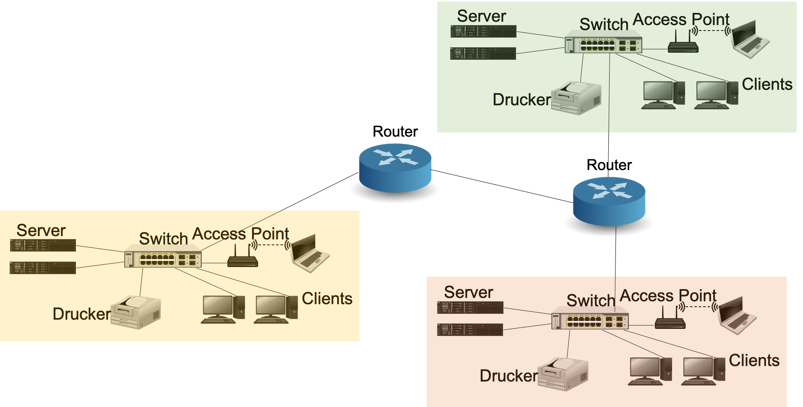
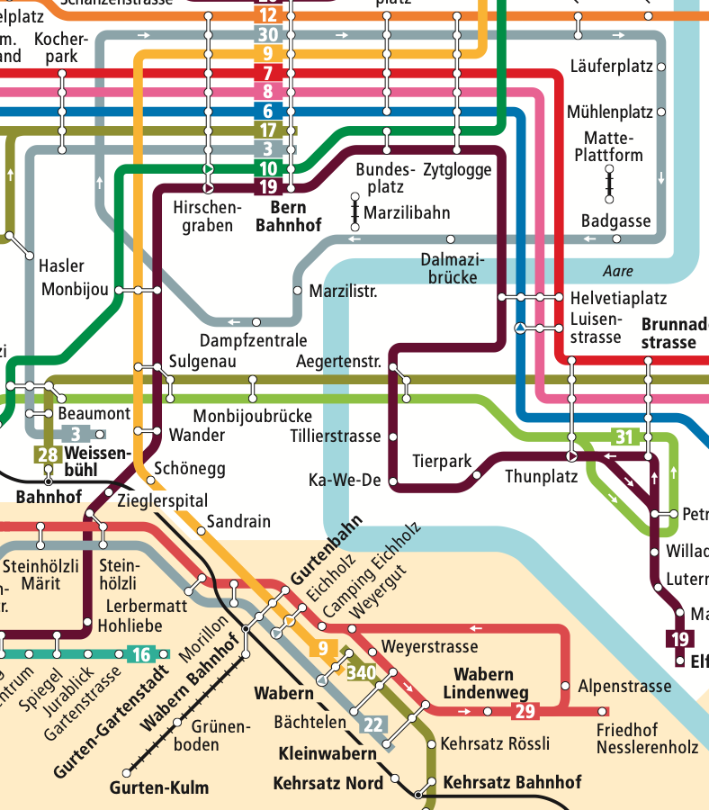

---
sidebar_custom_props:
  id: 916293c3-dff6-4bd5-9e6d-1bfef3ad1fda
---
# Routing
---

## Internet

Das **Internet** ist ein globales Netzwerk, das aus vielen miteinander verbundenen **Rechnernetzen** besteht und den
Austausch von Daten und Informationen ermöglicht.

---

::: warning Vorgehensweise
Lies dich selbständig durch dieses Kapitel durch, dabei

- löst du die Aufgaben und notierst deine Ergebnisse
- vor jedem «gewonnene Erkenntnisse» überlegst du kurz, was eine gewonnene Erkenntnis sein könnte – und zwar bevor du
  das Kästchen aufklappst
- lies die «gewonnenen Erkenntnisse» durch und überlege dir, was damit genau gemeint ist
- falls du eine Frage hast oder eine Erkenntnis notiert hast, die nicht aufgelistet wird, dann halte dies fest, damit
  wir am Schluss darüber sprechen können
  :::

Wir befinden uns auf der Internet-Schicht: Hier werden IP-Pakete vom Start- zum Zielgerät transportiert.
Bei ihrem Weg durch das Internet müssen die Pakete geleitet werden – man spricht von **Routing**.

## Bernmobil

Durch das Verkehrsnetz von Bernmmobil wird der öffentliche Verkehr in der Stadt Bern sichergestellt.

::: exercise

### :exercise: Auf Papier

Du möchtest vom Gymnasium auf den Gurten:

- Welche Möglichkeiten hast du?

Haltestellen, die du zu Fuss erreichen kann, sind Aegertenstrasse und Helvetiaplatz.
:::

::: exercise

### :exercise: Am Computer

Du möchtest vom Gymnasium auf den Gurten:

- Welchen Weg schlägt dir [bernmobil.ch](https://bernmobil.ch) vor?
- Ändert sich der Vorschlag spät in der Nacht?
  :::

::: details gewonnene Erkenntnisse

- Es gibt mehrere Wege, welche ans Ziel führen.
- Der optimale Weg kann sich ändern.
  :::

### Analogien

|                       |                                                                            |
|:----------------------|:---------------------------------------------------------------------------|
| **WLAN**              | zu Fuss bis zur nächsten Haltestelle                                       |
| **Sichtbare WLANs**   | Haltestellen, die zu Fuss erreichbar sind: Aegertenstrasse & Helvetiaplatz |
| **Rechnernetz (LAN)** | mit Bus, Tram oder Gurtenbahn                                              |
| **Router**            | Umsteigen an gewissen Haltestellen                                         |

## Routing für Touristen

Datenpakete sind – anders als wir als Passagiere von _Bernmobil_ – nicht intelligent. Sie wissen nicht, wie sie
umsteigen müssen. Dies muss jemand anders tun.

Wir nehmen also an, wir seien Touristen und wollen vom Gymer auf den Gurten fahren. An den Haltestellen, müssen wir also
Informationen finden, ob und auf welchen Bus/welches Tram wir umsteigen müssen. Auch können wir uns keine künftigen
Umsteige-Vorgänge merken, immer nur die aktuelle Haltestelle.

::: exercise

### :exercise: Routing-Tabelle

Erstelle für das Ziel «Gurten» Umsteige-Anleitungen für die folgenden Haltestellen :

- Aegertenstrasse
- Helvetiaplatz
- Zytglogge
- Sulgenau
- Gurtenbahn

Beispiel-Anleitung

|                  |                                          |
|:-----------------|:-----------------------------------------|
| **Hauptbahnhof** | auf Linie 9 in Richtung Wabern umsteigen |

:::

::: exercise

### :exercise: andere Ziele

Die Anleitungen müssten natürlich auch Anweisungen haben für andere Ziele.

- Wie würde eine Umsteigungsweisung lauten für 6 obenstehenden Haltestellen für das Ziel «Zürich»?
- Wie für das Ziel «Genf»?
- Muss jede Haltestelle wirklich Anweisungen für jedes andere Ziel haben?
  :::

::: details gewonnene Erkenntnisse
Es können Anweisungen «delegiert» werden: So muss nur der Hauptbahnhof wissen, in welchen Zug man einsteigen muss für
Zürich oder Genf. Die anderen bernmobil-Haltestellen leiten alle Anfragen ausserhalb des bernmobil-Netzes an den
Hauptbahnhof weiter.

:::

::: exercise

### :exercise: Ausfall Schienennetz

Du möchtest vom Gymnasium auf den Gurten:
Wegen einer grösseren Fehlfunktion stehen aber sämtliche Trams. Busse verkehren weiterhin.

- Finde einen neuen Weg!

:::

::: details gewonnene Erkenntnisse

- Es gibt verschiedene Wege, auch normalerweise nicht optimale
- Dadurch existiert eine gewisse Ausfallsicherheit

:::

::: exercise

### :exercise: Grosse Gruppe

4 Parallelklassen – also ca. 100 Personen inkl. LK machen einen Ausflug zum Abendpicknick auf den Gurten.
Wie kommen sie am schnellsten dahin, wenn wir damit rechnen, dass wegen Corona und dem Feierabendverkehr maximal 25
Personen pro Tram/Bus Platz finden?

:::

::: details gewonnene Erkenntnisse

- Bei Engpässen können verschiedene Wege gleichzeitig benutzt werden. (_Load-Balancing_)
  :::

## Routing für Datenpakete

Routing-Algorithmen sorgen dafür, dass Datenpakete ihren Weg durch das Internet finden. Dabei kann es sein, dass mehrere
Pakete mit dem selben Ziel unterschiedliche Routen nehmen.

 (CC-BY-NC-SA)](./images/routing.svg)

### Router im Schichtenmodell

Router stellen die Verbindung zwischen unterschiedlichen Netzwerken her. Sie müssen die IP-Pakete auspacken, damit diese
gemäss der IP-Adresse weitergeleitet werden können. Dabei bedienen sich Router spezieller Tabellen, welche angeben,
wohin ein Paket mit einer bestimmten IP-Adresse hingeleitet werden soll.

](./images/router.svg)

### Routen verfolgen

Der Befehl `traceroute` (macOS) resp. `tracert` (Windows) kann die Route von IP-Pakete nachverfolgen. Dabei werden die
Zwischenstationen – also dort wo das Paket entpackt und gemäss Ziel-IP-Adresse weitergeleitet wird – angezeigt.

::: exercise

### :exercise: traceroute

Öffne eine Eingabeaufforderung und gib die folgendene drei Befehl ein:

     tracert admin.ad.kinet.ch
     tracert www.google.ch
     tracert www.gymkirchenfeld.ch

Beobachte den Output. Erkennst du Gemeinsamkeiten oder irgendeine spezielle Zwischenstation?
:::

## «Highspeed-Routen»

### Schweiz

Auf der untenstehenden Karte erkennt man die schnellsten Leitungen von Switch. Diese Organisation verbindet die
Universitäten und Forschungsinstitute miteinander und mit dem Ausland.

](./images/SWITCHlanBackbone.jpg)

Andere Provider besitzen ebenfalls schnelle Leitungen zwischen den Städten und ins Ausland. Z.B. wurden bestehenden
Gas-Leitungen mit schnellen Glasfaser-Kabeln versehen

](./images/GASCOM_netzKarte.png)

### Interkontinental

Bei der Verbindung von Kontinenten hatte man schon vor dem Internet-Zeitalter Unterseekabel verlegt.

](./images/Eastern_Telegraph_cables.png)

Heute laufen zahlreiche «Highspeed-Routen» über den Grund der Meere.

<VideoEmbed provider="youtube" embedId="0TZwiUwZwIE" caption="IDG.tv" link="https://youtu.be/0TZwiUwZwIE" />

::: exercise

### :exercise: Unterseekabel

Wie kommt ein Datenpaket von Bern

- in die USA?
- nach Madagaskar?

[https://www.submarinecablemap.com/](https://www.submarinecablemap.com/)
:::
