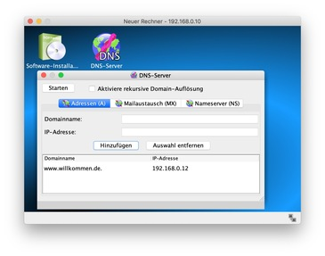
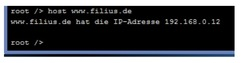

---
sidebar_custom_props:
  id: 6478e6e7-98b3-47fa-9129-8fbb827848c0
---
# 12.10 DNS-Einträge erstellen[^1]
---

<VueVideo id="FtsSm5zSL-c"/>

::: exercise
#### :exercise: Aufgabe 10
1. Installiere auf dem **DNS-Server** die Software _DNS-Server_.
2. Öffne die Software _DNS-Server_.
3. Erstelle einen DNS-Eintrag für unseren **Webserver** mit der IP-Adresse `10.200.0.51` und dem Domainnamen `www.willkommen.ch`.
4. Klicke auf den Knopf _Starten_, um den DNS-Server zu starten.

   

5. Öffne nun auf dem **NB 4** den Webbrowser (installiere ihn falls nötig). Öffne dort die Seite `http://www.willkommen.ch`. Du solltest nun mit dem Domainnamen auf die erstellte Webseite zugreifen können.
6. Jetzt wollen wir den DNS-Server noch von Hand abfragen:
   - Öffne die Befehlszeile auf einem weiteren Notebook (und installiere sie falls nötig).
   - Gib den Befehl `host www.willkommen.ch` ein.
   - Betrachte die Ausgabe und kontrolliere, ob die richtige IP-Adresse angezeigt wird.

   

7. **Abschluss:** Bitte speichere die fertige Aufgabe unter dem Namen _Aufgabe-10.fls_ ab.
8. Erkläre deiner Pultnachbarin/deinem Pultnachbarn die Funktionsweise eines DNS-Servers.
:::

[^1]: Quelle: Adrian Sauer (2020), [Interaktiver Kurs zu Rechnernetzen](https://www.tutory.de/w/c4ae6cde), [CC BY-SA 4.0](https://creativecommons.org/licenses/by-sa/4.0/)
