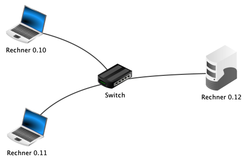

---
sidebar_custom_props:
  id: 38046043-f6a2-4787-a22b-4dd206201162
---
# 12.3 Switch[^1]
---

<VueVideo id="_LSYWZRcfM4"/>

::: info
#### :mdi-lightbulb-on: Switch
Ein Switch ist ein Gerät mit vielen Netzwerkanschlüssen, um Computer untereinander zu verbinden. Da jeder Computer in der Regel nur über einen solchen Anschluss verfügt, ist der Einsatz von Switches notwendig, um mehr als zwei Computer miteinander zu verbinden. In grösseren Netzen sind mehrere Switches sinnvoll. In der Regel werden diese in Form eines Baums angeordnet.
:::

::: exercise
#### :exercise: Aufgabe 3
Erweitern wir nun unser Netzwerk.
1. Füge einen dritten Computer – diesmal einen Server – mit dem Namen **Webserver** und der IP-Adresse `10.200.0.51` hinzu.
1. Verbinde alle Computer mit einem Switch wie abgebildet.

   

1. Versuche, von jedem Computer aus die anderen beiden zu pingen.
1. Wie würde man einen Switch nennen, wenn wir von einem Stromnetz sprechen würden, anstatt von einem Computernetzwerk? Halte die Antwort im Dokumentationsmodus in Filius **schriftlich** fest.
1. **Abschluss:** Bitte speichere die fertige Aufgabe unter dem Namen _Aufgabe-03.fls_ ab.
:::

[^1]: Quelle: Adrian Sauer (2020), [Interaktiver Kurs zu Rechnernetzen](https://www.tutory.de/w/c4ae6cde), [CC BY-SA 4.0](https://creativecommons.org/licenses/by-sa/4.0/)
