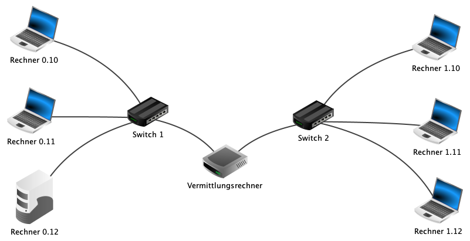
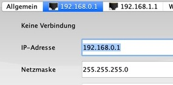

---
sidebar_custom_props:
  id: 5c797f14-7f1b-4ddf-8dd2-15cb82ee045e
---
# 12.4 Router[^1]
---

<VueVideo id="pWO_fSIt6Ag"/>

::: info
#### :mdi-lightbulb-on: Router = Vermittlungsrechner

Wir kommen nun in die Situation, dass wir zwei Netzwerke miteinander verbinden wollen. Zum Beispiel könnten wir das Netzwerk bei uns zu Hause mit dem Netzwerk der Schule verbinden wollen, um dort auf die Dateien zuzugreifen.

Wenn man Signale aus einem **Netzwerk 0** in ein anderes **Netzwerk 1** versenden möchte, dann benötigt man einen Router/Vermittlungsrechner. Ein Router verbindet mehrere Netzwerke. Ein Router befindet sich häufig an den Aussengrenzen eines Netzwerks, um es mit dem Internet oder einem anderen Netzwerk zu verbinden. Über die Routing-Tabelle entscheidet ein Router, welchen Weg ein Datenpaket nimmt.

Zu Anfang fragt Filius, wie viele Schnittstellen der Vermittlungsrechner bereitstellen soll. In unserem Fall reichen erstmal 2.

Die eingestellte Anzahl kann später in den Einstellungen des Vermittlungsrechners (Doppelklick auf den Vermittlungsrechner) unter der Registerkarte _Allgemein_ verändert werden.
:::

::: exercise
#### :exercise: Aufgabe 4
Nun verbinden wir mehrere verschiedene Netzwerke mit einem Router.

1. Erstelle ein weiteres Netzwerk mit drei Computern und einem Switch. Die neuen Computer sollen sich in einem anderen Netzwerk befinden, d.h. dass sich die IP-Adressen auch in den vorderen Teilen unterscheiden. Wähle für das **Netzwerk 1** dafür IP-Adressen aus dem Bereich `10.200.1.x` und die Namen **NB 4** bis **NB 6**.
1. Füge nun einen Router dazwischen ein. Wähle 2 Schnittstellen aus, da wir zwei Netzwerke verbinden wollen.
1. Der Router braucht nun auch 2 IP-Adressen. Doppelklicke dazu auf den Vermittlungsrechner und achte dabei auf die grün leuchtenden Verbindungskabel, damit du die korrekte IP-Adresse beim jeweiligen Netzwerk eingibst!

   

   - `10.200.0.1` auf der Seite des **Netzwerks 0**.
   - `10.200.1.1` auf der Seite des **Netzwerks 1**.
1. Wechsle in den Aktionsmodus:
   - Öffne auf **NB 1** die Befehlszeile.
   - Teste die Verbindung, indem du einen Ping an die IP-Adresse des **NB 6** sendest.

   **Achtung**: Ist der Ping **nicht** erfolgreich? Dann hast du alles korrekt gemacht! Abwarten... 😉

1. **Abschluss:** Bitte speichere die fertige Aufgabe unter dem Namen _Aufgabe-05.fls_ ab.
1. Benutzt ihr zu Hause einen Router? Wofür wird er verwendet?

***
[Musterlösung](./aufgabe-05.fls)
:::

[^1]: Quelle: Adrian Sauer (2020), [Interaktiver Kurs zu Rechnernetzen](https://www.tutory.de/w/c4ae6cde), [CC BY-SA 4.0](https://creativecommons.org/licenses/by-sa/4.0/)
