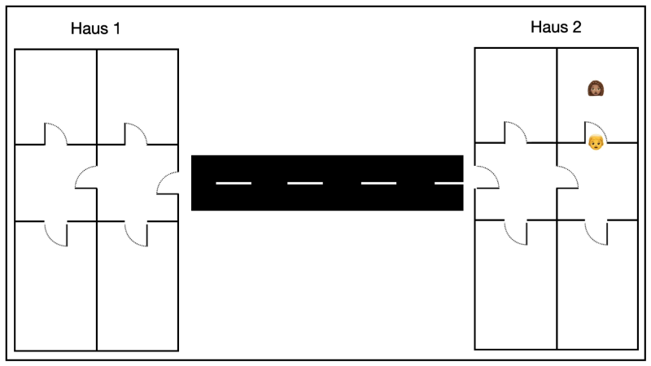

---
sidebar_custom_props:
  id: 9720cf9c-bb48-4615-8bde-0fea13f44b2f
---
# 12.5 Gateway[^1]
---

<VueVideo id="iI-u1ovOUQo"/>

> #### :mdi-lightbulb-on: Analogie
>
> Stell dir vor, du möchtest deine Freundin Franziska besuchen.
>
> Wenn du sie sehen willst, musst du zu ihr hingehen. Du fängst also an, schaust bei dir zu Hause und öffnest die Tür zum Wohnzimmer: nichts. Hinter der Tür der Küche: Keine Franziska. Und im Bad: Ebenfalls niemand. Hinter all diesen Türen kannst du sie nicht finden. Das ergibt auch Sinn, denn Franziska wohnt nicht bei dir zu Hause.
>
> Also musst du eine Tür finden, durch die du gehen kannst, um sie zu finden. Na klar: Die Haustür.
>
> Du gehst also durch die Haustür und bis hin zu Franziskas Haus.
>
> Dort angekommen gehst du durch ihre Haustür. Im Innern findest du den Weg in ihr Zimmer. Und siehe da: Franziska ist da!

::: columns 2

***

:::

::: info
#### :mdi-lightbulb-on: Gateway – die Haustür
Verbindet man mehrere Netzwerke (z.B. Netzwerk 0 und Netzwerk 1) miteinander oder mit dem Internet, so muss ein Router/Vermittlungsrechner genutzt werden. Das weisst du schon von gerade eben.

Nun müssen die Computer in einem LAN (engl. *Local Area Network*) aber wissen, wie sie aus diesem LAN «herauskommen» und auf das WAN (engl. *Wide Area Network*) zugreifen können. Dazu müssen sie eine «Durchgangs-IP-Adresse» oder *Gateway-IP-Adresse* kennen, quasi die Haustür (die Tür zum Internet oder zu anderen Netzwerken). An diese «Durchgangs-IP-Adresse» müssen sich die Computer wenden, wenn die angefragte IP im LAN nicht vorhanden ist. Diese «Durchgangs-IP-Adresse» nennt sich *Gateway* oder *Gateway-IP*.

Die Gateway-IP ist normalerweise die IP des Routers/Vermittlungsrechners, da dieser ja eben mehrere Netzwerke miteinander verbindet.

Für unser konkretes Beispiel heisst das:

Ich will von meinem **NB 1** im Netzwerk «0» das **NB 6** im Netzwerk «1» anpingen. Das klappt nicht, da es im Netzwerk 0 kein **NB 6** gibt.

Also sage ich dem **NB 1**: «Wenn du eine IP anpingen willst, die es in unserem Netzwerk nicht gibt, dann schicke die Pakete an dein Gateway, das die Pakete in die verbundenen Netzwerke weiterleitet.»
:::

::: exercise
#### :exercise: Aufgabe 5
Der Ping in der vorherigen Aufgabe war nicht erfolgreich. Das Problem liegt darin, dass die Ping-Pakete in ein anderes Netzwerk weitergeleitet werden müssten.

Allerdings ist bei den einzelnen Computern noch kein Gateway eingestellt, welches bestimmt, wer die Pakete weiterleitet, die nicht im eigenen Netzwerk verbleiben sollen.

1. Eine der IP-Adressen des Routers lautet `10.200.0.1`. Diese Adresse fügst du als Gateway bei allen drei Computern im **Netzwerk 0** hinzu.
2. Die IP-Adresse des Routers im anderen Netzwerk lautet `10.200.1.1`, diese wird als Gateway für die drei Computer im **Netzwerk 1** verwendet.
3. Prüfe anschliessend im Aktionsmodus die Verbindung mit einem `ping`-Befehl von **NB 1** zum **NB 6**.
4. **Abschluss:** Bitte speichere die fertige Aufgabe unter dem Namen _Aufgabe-05.fls_ ab.
:::

[^1]: Quelle: Adrian Sauer (2020), [Interaktiver Kurs zu Rechnernetzen](https://www.tutory.de/w/c4ae6cde), [CC BY-SA 4.0](https://creativecommons.org/licenses/by-sa/4.0/)
