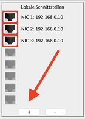
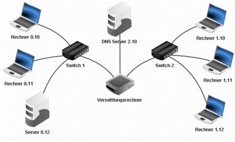

---
sidebar_custom_props:
  id: 910997ea-21bc-4997-a225-8ee75cfd25b6
---
# 12.8 DNS-Server[^1]
---

<VueVideo id="-pqEJJbJcBA"/>

::: info
#### :mdi-lightbulb-on: Domain Name System (DNS-Server)
Kennst du die Handynummern all deiner Freunde auswendig? Wahrscheinlich nicht. Du hast sie einfach in deinem Handy abgespeichert und wenn du sie anrufen willst, musst du nur ihren Namen suchen. Denn Namen kann man sich viel leichter merken als lange Zahlenkombinationen.

Das gleiche Problem haben wir im Internet. Jeder Webserver hat eine IP, unter der man ihn erreicht. So ist das auch in unserem kleinen, nachgebauten Internet. Diese langen Zahlenkolonnen kann man sich aber schlecht merken – also nutzt man Namen. Diese Namen nennt man Webadresse oder auch «URL» (Uniform Resource Locator). Sie lauten zum Beispiel **www.gymkirchenfeld.ch** oder **www.wikipedia.ch**.

Anstatt eines Telefonbuches benutzt man das **Domain Name System** (DNS). Diese Zuordnung (also dass jemand, der `www.gymkirchenfeld.ch` eingibt, dann auf der richtigen IP landet) erledigt ein DNS-Server. Er kennt die IP der Webseite. Wenn jemand in seinem Browser die URL eingibt, wird beim DNS-Server nachgefragt: Welche IP-Adresse soll ich aufrufen? Der DNS Server antwortet und der Client kann die gewünschte IP-Adresse kontaktieren.
:::

::: exercise
#### :exercise: Aufgabe 8
DNS-Server hinzufügen

Der DNS-Server **kann in einem beliebigen Netzwerk** angeschlossen werden. Wir verwenden (wie im Video) ein neues Netzwerk (**Netzwerk 2**). So können wir üben, einen Router um ein Netzwerk zu erweitern.

1. **Netzwerk 2** hinzufügen:
   - Doppelklicke auf den Router/Vermittlungsrechner.
   - Klicke auf _Verbindungen verwalten_.
   - Klicke rechts auf das _+_ unten, um einen weiteren Anschluss hinzuzufügen.
   - Wähle für das Netzwerk 2 einen beliebigen IP-Adresse-Bereich und ändere die IP-Adresse des neuen Anschlusses auf die erste Adresse deines neuen Netzwerkes (`x.y.z.1`).

   

2. Einen neuen Server erstellen:
   - Ändere den Namen auf `DNS-Server`.
   - Ändere die IP-Adresse des DNS-Server auf beliebige IP-Adresse in deinem oben gewählten Netzwerk.
   - Trage das korrekte Gateway ein.
3. Verbinde den DNS-Server mit dem Vermittlungsrechner/Router mit einem Kabel.
4. Teste, ob du von **NB 1** aus den **DNS-Server** pingen kannst. Überprüfe die vorherigen Schritte, falls dies nicht klappt.
5. **Abschluss:** Bitte speichere die fertige Aufgabe unter dem Namen _Aufgabe-8.fls_ ab.
6. Mit welchem Alltagsgegenstand lässt sich ein DNS vergleichen?

:::

[^1]: Quelle: Adrian Sauer (2020), [Interaktiver Kurs zu Rechnernetzen](https://www.tutory.de/w/c4ae6cde), [CC BY-SA 4.0](https://creativecommons.org/licenses/by-sa/4.0/)
