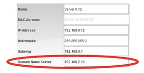

---
sidebar_custom_props:
  id: 29499649-e6f9-4be2-a551-bed70a0d5178
---
# 12.9 DNS auf Clients eintragen[^1]
---

<VueVideo id="zoXKPYcF2Dk"/>

::: exercise
#### :exercise: Aufgabe 9
DNS Server auf den Clients eintragen

1. Trage bei **jedem Notebook** und beim **Webserver** (damit auch dieser seinen eigenen Namen auflösen und die eigene Webseite besuchen könnte) die IP-Adresse des DNS-Servers in den Einstellungen ein.

   

2. **Abschluss:** Bitte speichere die fertige Aufgabe unter dem Namen _Aufgabe-9.fls_ ab.
:::

[^1]: Quelle: Adrian Sauer (2020), [Interaktiver Kurs zu Rechnernetzen](https://www.tutory.de/w/c4ae6cde), [CC BY-SA 4.0](https://creativecommons.org/licenses/by-sa/4.0/)
