---
sidebar_custom_props:
  id: 1bcf4c74-6ecb-4d69-93d8-40edd173d77e
---
# :mdi-apple: Installation auf macOS
---

## Java installieren

Damit du Filius auf macOS starten kannst, muss du erst Java installieren:

::: details Java-Installation Schritt für Schritt

1. Wähle die richtige Version aus:

    1. Klicke auf das Apple Logo oben links:

        

    2. Klicke auf "Über diesen Mac":

        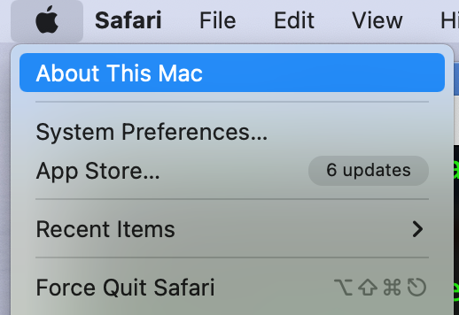

    3. Steht unter dem Punkt "Prozessor" resp. "Chip" etwas mit "Apple M...":

        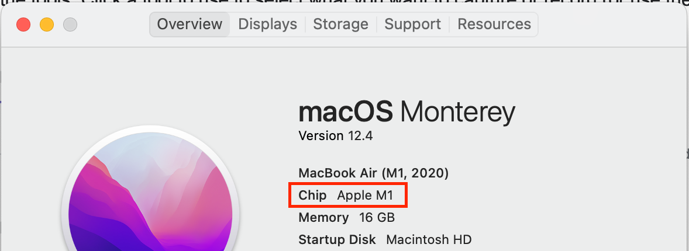

       verwende folgenden Link:

        * [:download: Java JDK 21.0.4 für macOS arm64 herunterladen][1]

       in allen anderen Fällen verwende folgenden Link:

        * [:download: Java JDK 21.0.4 für macOS x86_64 herunterladen][2]

2. Klicke hier auf __Fortfahren__:

    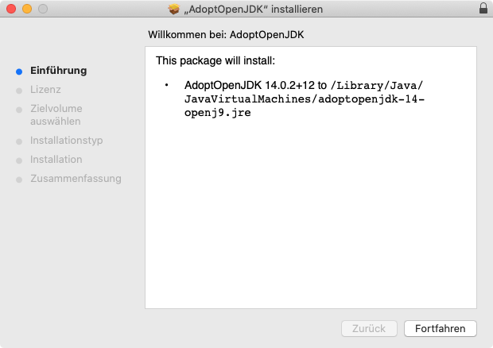

3. Klicke auf __Fortfahren__ und anschliessend auf __Akzeptieren__:

    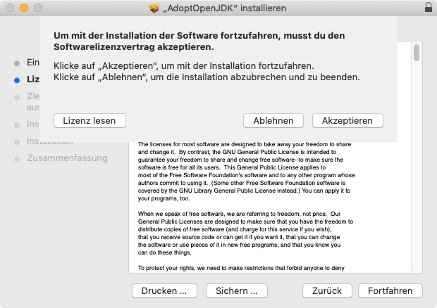

4. Klicke auf __Installieren__:

    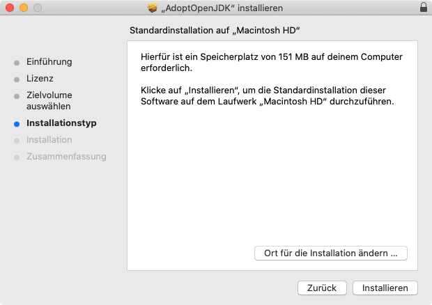

5. Bestätige die Installation mit deinem Fingerabdruck oder klicke auf __Passwort&nbsp;verwenden&nbsp;…__:

    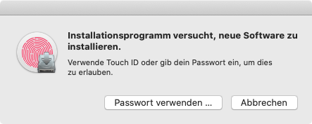

6. Klicke auf __Schliessen__, anschliessend auf __In&nbsp;den&nbsp;Papierkorb&nbsp;legen__:

    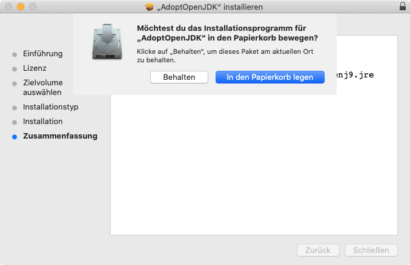

:::

## Filius installieren und ertmals starten

1. Lade die Filius DMG-Datei herunter (wenn mehrere Versionen verfügbar sind, nimmst du die aktuellste Version!):

* [:download: Filus 2.4.1 für macOS][3]

    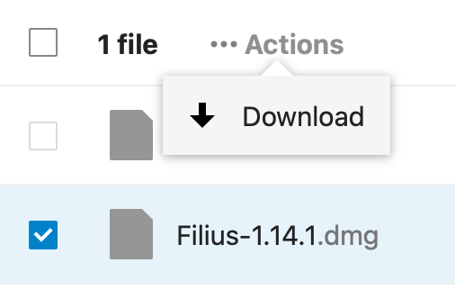

2. Öffne die Datei

    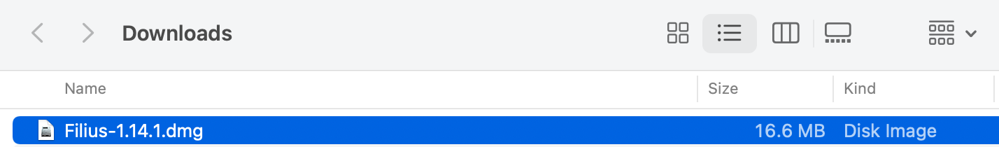

3. Kopiere Filius zu Applikationen

    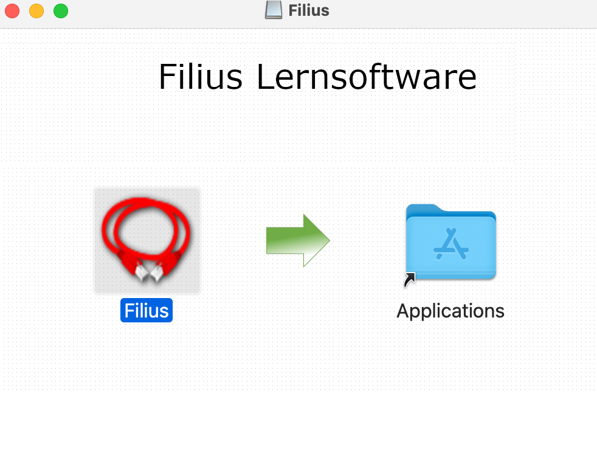

4. Da Filius keine *signierte* Anwendung ist, ist der erste Start ein wenig umständlich. Beim ersten Start erscheint folgende Meldung:

    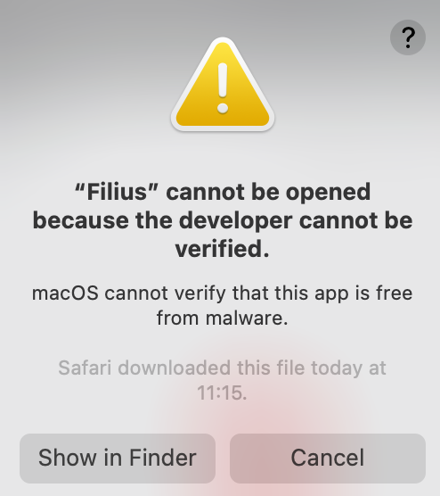

5. Öffne die _Systemeinstellungen_, wähle _Sicherheit_ und dort das Tab _Allgemein_. Überprüfe, ob in der unteren Hälfte wirklich «filius.jar» steht und klicke dann auf _Dennoch öffnen_:

    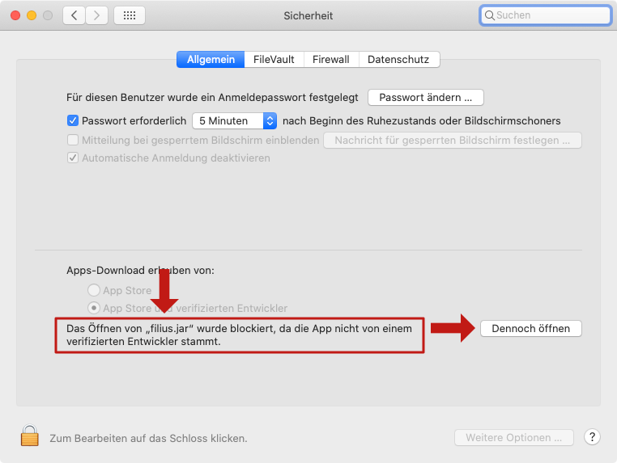

6. Klicke auf _Öffnen_:

    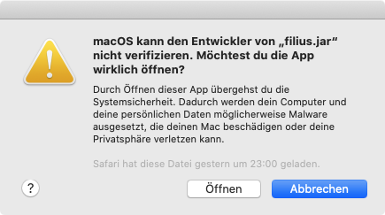

[1]: https://aka.ms/download-jdk/microsoft-jdk-21.0.4-macos-aarch64.pkg
[2]: https://aka.ms/download-jdk/microsoft-jdk-21.0.4-macos-x64.pkg
[3]: https://app.box.com/s/7pa38o97f32l6y32rzu4crqmsd5d0rid
