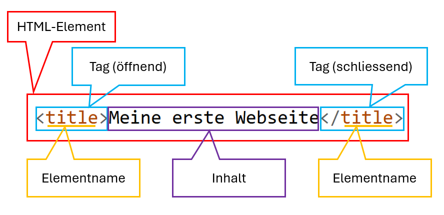

---
sidebar_custom_props:
  id: 501aa542-54e5-429c-a462-46f56ccb7593
---
# HTML & CSS

---

## HTML

Die **Hypertext Markup Language** ist eine sogenannte _Auszeichnungssprache_. Mit ihr können Dokumente
strukturiert werden. Die Struktur wird mittels Verschachtelung von HTML-Elementen erreicht

### HTML-Elemente

HTML-Elemente werden durch sogenannte _Tags_ gekennzeichnet. Ein Tag wird durch kleiner/grösser-Klammern
gekennzeichnet. Das Element beginnt mit dem öffnenden Tag `<element-name>`, dann kommt der Inhalt,
dann das schliessende Tag `</element-name>`:

::: info

#### Verallgemeinert:

```html
<element-name>Inhalt</element-name>
```
#### konkretes Beispiel:

```html
<title>Meine erste Webseite</title>
```


:::

### Struktur

Eine HTML-Datei hat eine vorgegebene Struktur. Gewisse Elemente müssen vorhanden sein und einige Verschachtelungen
sind nicht erlaubt. Jedes Dokument hat als Grundelement ein `html`-Element, das alles andere umfasst.
Direkt darin ist das `head`- und das `body`-Element.

```html
<html>
  <head></head>
  <body></body>
</html>
```

### head-Element

Das `head`-Element beinhaltet **Zusatzinformationen**, wie der Titel der Webseite und weitere Metainformation

```html
<html>
  <head>
    <title>Meine erste Webseite</title>
  </head>
  <body>
    Hallo Welt
  </body>
</html>
```

### body-Element

Im `body`-Element wird der gesamte **Inhalt** der Webseite, also Text, Überschriften, Bilder usw. verpackt.

```html
<html>
  <head>
    <title>Meine erste Webseite</title>
  </head>
  <body>
    <h1>Willkommen</h1>
    <p>Wie geht es so? <strong>Ich freue mich, dass du da bist!</strong></p>
  </body>
</html>
```

Das obige HTML-Dokument wird vom Browser so ausgegeben:

::: cards 2

<h1>Willkommen</h1><p>Wie geht es so? <strong>Ich freue mich, dass du da bist!</strong></p>

:::

::: exercise

### :exercise: Aufgabe Webseite erstellen

1. Erstelle einen neuen Ordner mit dem Namen `webseite` in deinem Informatikordner. Hier kommen alle zur Webseite
   gehörenden Dokumente rein.
2. Öffne Thonny.
3. Erstelle eine neue Datei mit dem obigen Inhalt und speichere diese im `webseite`-Ordner als `index.html` ab.
4. Gehe in den Datei-Explorer und mache einen Doppelklick auf das soeben erstellte HTML-Dokument.

Nun kannst du zwischen dem Editor und dem Browser hin- und herwechseln.
**Die Programme müssen nicht ständig geschlossen werden! Ändere etwas im Editor, speichere die Datei ab [Ctrl] + [S],
wechsle zum Browser und mache einen Reload [Ctrl] + [R]**

Wenn du Thonny geschlossen hast, kannst du `index.html` mittels Rechtsklick → öffnen mit → Thonny wieder bearbeiten.
:::

### Text-Struktur

Es gibt sogenannte _Block_-Elemente, welche den Text strukturieren. Diese Elemente sollten nicht ineinander
verschachtelt werden:

| Element       | Bedeutung                                               | Beispiel                 |
|:--------------|:--------------------------------------------------------|:-------------------------|
| `p`-Element   | steht für _Paragraph_, also Absatz                      | `<p>Wie geht es so?</p>` |
| `h1`-Element  | steht für _Heading 1_, also Überschrift 1               | `<h1>Willkommen</h1>`    |
| `h2` bis `h6` | weitere Überschriften für Unterkapitel bis zum 6. Level | `<h1>Willkommen</h1>`    |

Daneben gibt es sogenannte _Inline_-Elemente, die verwendet werden um Textteile innerhalb eines Block-Elementes zu
kennzeichen:

|          |                                                           |                                                     |
|:---------|:----------------------------------------------------------|:----------------------------------------------------|
| `strong` | Starke Hervorhebung (normalerweise **fett**)              | `<strong>Ich freue mich, dass du da bist!</strong>` |
| `em`     | _emphasis_, leichte Hervorhebung (normalerweise _kursiv_) | `<em>Ich freue mich, dass du da bist!</em>`         |

::: exercise

### :exercise: Text

Passe deine Webseite an:

- Erstelle einige Überschriften.
- Füge einige Absätze hinzu.

:::

### Attribute

Gewisse Elemente benötigen Zusatzinformationen. Diese wird mit sogenannten **Attributen** im öffnenden Tag drin gesetzt.
Attribute bestehen aus einem festen Namen und einem variablen Wert:

::: info

#### :info: Verallgemeinert:

```html
<element-name attributname="attributwert">Inhalt</element-name>
```

:::

Beispielsweise kann man mithilfe des Attributs `style` in den Text-Struktur-Elementen `h1` und `p` den Text farbig hervorheben:

```html
<h1 style="color:blue;">Blaue Überschrift</h1>
<p style="color:red;">Roter Text</p>
```

::: exercise
### :exercise: Formatierung

- Formatiere den Text von einem deiner Absätze blau, einen anderen Absatz grün.

:::

### Bilder

`img`-Elemente haben **keinen Inhalt** – es gibt darum kein schliessendes Tag. Das Bild ist in einer externen Bilddatei
und darauf muss natürlich verwiesen werden, sonst findet der Browser die Bilddatei nicht. 

```html

```

::: exercise

### :exercise: Bilder

Wir versuchen ein Bild einzubauen. Gehe dabei wie folgt vor:

- Suche ein Bild und speichere es in deinem Webseiten-Ordner ab
- Füge ein `img`-Element hinzu. Passe dabei den Wert des `src`-Attributes auf den Namen der Bilddatei an

:::

Bild-Elementen kann man mit weiteren Attributen zusätzliche Eigenschaften setzen. Mit den Attributen `width` legt und `height`kann man beispielsweise Höhe und Breite des Bildes festlegen

```html

```

::: exercise

### :exercise: `img`-Attribute

- Wozu dienen wohl die Attribute `alt` und `title`? Probiere es aus!

***

Lösung:

- `alt` = Alternativtext, der angezeigt wird, wenn das Bild nicht geladen werden kann. Wichtig für Barrierefreiheit, z.B. für sehbehinderte Personen.
- `title` = Tooltip-Text, der beim Überfahren mit der Maus angezeigt wird.

:::

### Links

Klickbare Links erzeugt man mit dem `anchor`-Element (abgekürzt zu `a`). Der Inhalt des Elementes ist klickbar, die zu
öffnende Seite gibt man mit dem Attribut `href` an.

```html
<a href="https://www.gymkirchenfeld.ch">Meine Schule</a>
```

::: cards 2

<a href="https://www.gymkirchenfeld.ch" target="_blank">Meine Schule</a>

:::

Der Link kann sowohl zu einer anderen Seite im Internet führen (wie im Beispiel) als auch zu einer weiteren eigenen
`.html`-Datei. Dazu kann man beim Attribut `href` den Namen der Datei angeben. 

```html
<a href="zweiteSeite.html">Meine zweite Webseite</a>
```


::: exercise

### :exercise: Links

- Baue einige Links zu externen Seiten ein
- Erstelle eine zweite Seite `kontakt.html` und verlinke diese mit `index.html`
- Vergiss nicht einen Link zurück zur Startseite einzubauen

:::

::: exercise

### :exercise: Zusatzaufgabe

Ergänze deine Seite um «richtigen» Inhalt, z.B. über dich, dein Lieblings-Fussballteam oder deine Lieblings-Band, oder
über dein Hobby oder sonst irgendetwas.

:::

## CSS

Die Webseite soll ja nicht nur einen tollen Inhalt haben, sondern auch grafisch etwas hermachen. Dazu formuliert man
«Formatvorlagen», sogenannte **Cascading Style Sheet**-Regeln.

Eine Regel besteht immer aus zwei Teilen:

1. Für welche Elemente sie gelten sollen.
2. Wie diese Elemente gestaltet werden sollen.

### Selektor

Mithilfe des sogenannten **Selektors** werden die Elemente ausgewählt, für welche die Regeln gelten sollen. Wir
verwenden nur den Element-Selektor (es gibt noch andere).

```css
element-name {
}
```

Die obenstehende Regel gilt für alle Elemente vom Typ `element-name`. Zwischen die geschweiften Klammern kommen nun
die Formatierungsbefehle.

Wollen wir also alle Überschriften anpassen, dann schreiben wir den folgenden Selektor:

```css
h1 {
}
```

### Formatierungsbefehle

Formatierungsbefehle bestehen aus dem Namen der Eigenschaft, die man formatieren möchte, und einem Wert. Je nachdem was
formatiert wird, stehen als Werte Farben, Masse und vordefinierte Werte zur Auswahl

```css
element-name {
    eigenschaft1: wert;
    eigenschaft2: wert;

    ...
;
}
```

### Beispiel

Die folgenden Regeln setzen eine andere Schriftart, machen den Hintergrund der Seite schwarz, den Text farbig und einen
Rahmen um die Überschrift:

```css
body {
    font-family: Arial, Helvetica, sans-serif;
    background-color: black;
}

h1 {
    color: yellow;
    border: 1px dotted pink;
}

p {
    color: green;
}
```
::: details Detaillierte Erklärung

Die Eigenschaft `font-family` wird gesetzt. Da je nach System eine Schriftart nicht verfügbar sein könnte, wird eine 
Liste mit abnehmender Priorität angeben: `Arial, Helvetica, sans-serif;`

Mit der Eigenschaft `background-color` kann die Hintergrundfarbe eines Elementes gesetzt werden. Es können 
[Namen](https://www.w3schools.com/colors/colors_names.asp) für Farben eingesetzt oder 
[Farbcodes](https://www.w3schools.com/colors/colors_rgb.asp) verwendet werden.

Die Eigenschaft `color` wird verwendet, um die Überschrift gelb und den Text grün zu färben.

Mit `border` kann ein Element mit einem Rahmen versehen werden. Dazu müssen drei Eigenschaften aufs Mal angegeben 
werden: `border-width`, `border-style` und `border-color`

:::


### Mit HTML-Dokument verknüpfen

::: warning Verweis auf CSS-Datei

Im HTML-Dokument muss die zu verwendende CSS-Datei angegeben werden! So können auch mehrere HTML-Dokumente
dieselbe CSS-Datei verwenden.

:::

```html
<html>
  <head>
    <title>Meine erste Webseite</title>
    <link rel="stylesheet" href="style.css"/>
  </head>
...
</html>
```

::: exercise

### :exercise: Aufgabe

- Erstelle eine Textdatei mit dem obenstehenden CSS-Regeln und speichere sie im Ordner `webseite` als `style.css` ab
- Füge im `head`-Element deiner HTML-Dokumente einen Link zur CSS-Datei ein (Zeile 4, unterhalb von `title`)
- Lade dein HTML-Dokument im Browser neu ([Ctrl] + [R])
- Passe Schriftart, Farben und weitere Dinge an, so wie es dir gefällt

Hier findest du weitere Eigenschaften:
[https://wiki.selfhtml.org/wiki/CSS/Eigenschaften](https://wiki.selfhtml.org/wiki/CSS/Eigenschaften)
:::
