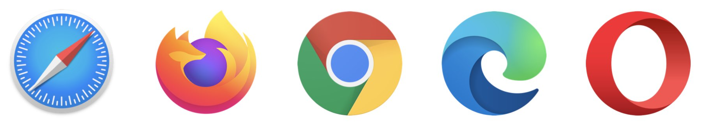
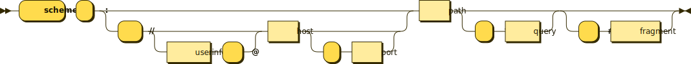

---
sidebar_custom_props:
  id: 2a6d5aeb-0e6c-4594-8f60-35e1e575e8bd
---

# World Wide Web

Zur Erfolgsgeschichte des Internets beigetragen hat vor allem das **World Wide Web**, als einer der am häufigsten genutzten 
Internet-Dienste. Immer mehr werden schon länger existierende Dienste durchs WWW resp. durch eine Web-Anwendung ersetzt. 
So hat man heute auf E-Mails nicht nur per E-Mail-Protokoll, sondern auch über den Browser und eine spezielle Webseite, 
eine sogenannte Web-Anwendung zugriff. Doch wie kam das WWW zustande?

## Geschichte

Tim Berners-Lee, ein britischer Forscher, der damals im CERN in Genf arbeitete, erstellte 1991 den ersten Webserver, den 
ersten Webbrowser und die erste Webseite. Man wollte damit Forschungsergebnisse anderen Forscher einfach zugänglich machen
– ohne dass diese z.B. per E-Mail nach den Resultaten fragen und man diese dann anschliessend zurückschicken musste.

- Die Seite kann immer noch besucht werden:   
[http://info.cern.ch/hypertext/WWW/TheProject.html](http://info.cern.ch/hypertext/WWW/TheProject.html)
    
- Für den Webbrowser gibt es eine Simulation (_Funktioniert momentan nicht, Stand 13.08.25_):   
[https://worldwideweb.cern.ch/](https://worldwideweb.cern.ch/)

Die meisten Leute hatten damals gar kein Gerät, welche eine mit Maus bedienbare grafische Benutzeroberfläche bot. Deshalb wurde 1992 ein Text-Browser veröffentlicht: Statt auf Links zu klicken, erhielt jeder Link auf der Webseite eine Nummer, die man eintippen konnte. So konnten die wenigen Personen, die überhaupt einen Computer mit Internetverbindung 
hatten, im Web surfen.

- Besuche die erste Webseite mit dem simulierten Text-Browser:  
  [http://line-mode.cern.ch/www/hypertext/WWW/TheProject.html](http://line-mode.cern.ch/www/hypertext/WWW/TheProject.html)

::: exercise
### :exercise: Aufgabe
Teste die drei obenstehenden Links aus:

- Besuche die erste Webseite mit deinem Browser
- Besuche die erste Webseite mit dem Text-Browser (_line mode browser_)
- Versuche andere Webseiten mit dem grafischen Browser von damals zu öffnen.

:::

## Standards

Das WWW basierte ursprünglich auf drei Standards:

|       |                                                                                                                                |
|:------|:-------------------------------------------------------------------------------------------------------------------------------|
| HTTP  | Das _Protokoll_, mit dem der Browser Informationen vom Webserver anfordern kann                                                |
| HTML  | Die _Auszeichnungssprache_, die festlegt, wie die Information gegliedert ist und wie die Dokumente verknüpft sind (Hyperlinks) | 
| URI   | Der _Uniform Resource Identifier_ als eindeutige Bezeichnung einer Ressource, die in Hyperlinks verwendet wird                 | 

Später kamen drei weitere Standards dazu:

|       |                                                                                                                                                             |
|:------|:------------------------------------------------------------------------------------------------------------------------------------------------------------|
| CSS   | Die _Cascading Style Sheets_ beschreiben das Aussehen und die Anordnung der Elemente einer Webseite, womit der Inhalt von dessen Darstellung separiert wird |
| HTTPS | Das _Hypertext Transfer Protocol Secure_ ist eine Weiterentwicklung von HTTP, bei dem die Daten verschlüsselt übermittelt werden                            |
| DOM   | Das _Document Object Model_ als clientseitige Programmierschnittstelle für Skriptsprachen (wie z.B. _JavaScript_) im Webbrowser                             |

## Browser

**Browser** sind Programme, welche Webseiten herunterladen und darstellen. Wenn der Anwender also z.B. www.gymkirchenfeld.ch in der Adresszeile des Browsers eintippt oder irgendwo einen Link anklickt, dann kontaktiert der Browser den entsprechenden Webserver und verlangt die Webseite. Falls der Server das verlangte Dokument hat, so sendet er es zurück. Der Browser setzt nun Dokumente (HTML-Code, Bilder, CSS, ...) zusammen und stellt die Webseite grafisch dar, so dass der Benutzer die Inhalte anschauen kann.

Die meisten Betriebssysteme liefern bereits einen Browser mit:

- Microsoft liefert zu Windows seinen _Edge_-Browser (früher _Internet Explorer_)
- Apple integriert _Safari_ auf seinen macOS-Geräten
- auch mobile Geräte haben bereits einen Browser installiert

Allerdings kann man auch selbst einen Browser wählen und diesen verwenden. Die meisten Browser sind frei verfügbar:

|               |                                                                                            |
|:--------------|:-------------------------------------------------------------------------------------------|
| Google Chrome | integriert in Google-Welt   in den letzten Jahren Nutzer gewonnen                       |
| Firefox       | freier Browser (Opensource)   hat in den letzten Jahren Benutzer verloren               |
| Opera         | norwegischer Browserpionier (Tabs, Mausgesten)     heute nur noch wenig weit verbreitet |

::: warning Der Browser ist eine exponierte Anwendung!

- Du surfst damit auf dir bekannten und dir unbekannten Webseiten
- Ein veralteter Browser mit Sicherheitslücken dient als Angriffspunkt für Hacker

**Du solltest einen aktuellen Browser verwenden und die dafür verfügbaren Updates immer installieren!**
:::

:::aufgabe
### :exercise: Browser Updates
Ist dein Browser "up to date?" Wo findest du die Versionsnummer? Wo kannst du auf Updates prüfen? 
Werden Updates automatisch installiert?
:::

## URI

Der _Uniform Resource Identifier_ identifiziert eindeutig eine Ressource (eine Webseite, sonstige Dateien, einen E-Mail-Empfänger, ...) im Internet.

### Schema

Im folgenden Syntax-Diagramm wird der Aufbau einer URI erläutert.

<figcaption>

Bild: OmenBreeze via [Wikimedia Commons](https://commons.wikimedia.org/wiki/File:URI_syntax_diagram.svg)

</figcaption>

 

Der kürzeste URI (im Schema alles oben durch) lautet: `schema:path`. Die beiden Komponenten `schema` und `path` sind also obligatorisch und müssen in jedem URI vorkommen!

### Beispiel

Im untenstehenden Beispiel wird ein komplexer URI in seine Bestandteile zerlegt:

            userinfo       host      port
            ┌──┴───┐ ┌──────┴──────┐ ┌┴┐
    https://john.doe@www.example.com:123/forum/questions/?tag=networking&order=newest#top
    └─┬─┘  └────────────┬──────────────┘└───────┬───────┘ └───────────┬─────────────┘ └┬┘
    scheme          authority                  path                 query           fragment

::: exercise
### :exercise: URI-Teile
Unterteile die folgenden URIs in ihre Bestandteile:

    http://google.ch/?q=gymkirchenfeld
    mailto:support@gymkirchenfeld.ch
    tel:+41313592510
    https://ict.mygymer.ch/byod/misc/e-mail-vergleich.html#vorhandenes-e-mail-programm

:::

::: details Lösung «URI-Teile»

            host
          ┌───┴────┐
    http://google.ch/?q=gymkirchenfeld
    └─┬─┘└───┬─────┘└┐└─────┬────────┘
    scheme authority path   query

    mailto:support@gymkirchenfeld.ch
    └─┬──┘ └──────────┬────────────┘
    scheme          path

    tel:+41313592510
    └┬┘ └────┬─────┘
    scheme  path

               host
            ┌────┴───────┐
    https://ict.mygymer.ch/byod/misc/e-mail-vergleich.html#vorhandenes-e-mail-programm
    └─┬─┘  └──────┬──────┘└─────────────┬────────────────┘ └───────────┬─────────────┘
    scheme    authority               path                            fragment

:::

::: exercise
### :exercise: Zusatzaufgabe

Arbeite an deiner eigenen Webseite weiter. 

- füge weitere HTML-Dateien mit Überschriften, Bilder, Listen, … und Links untereinander ein.
- erweitere die CSS-Formatierungen

:::

