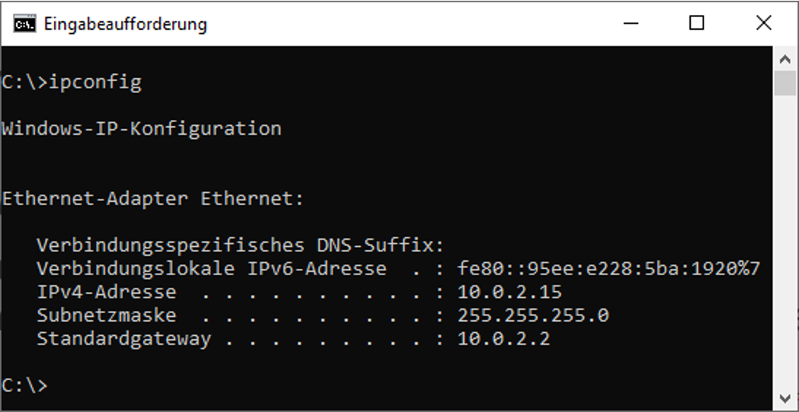
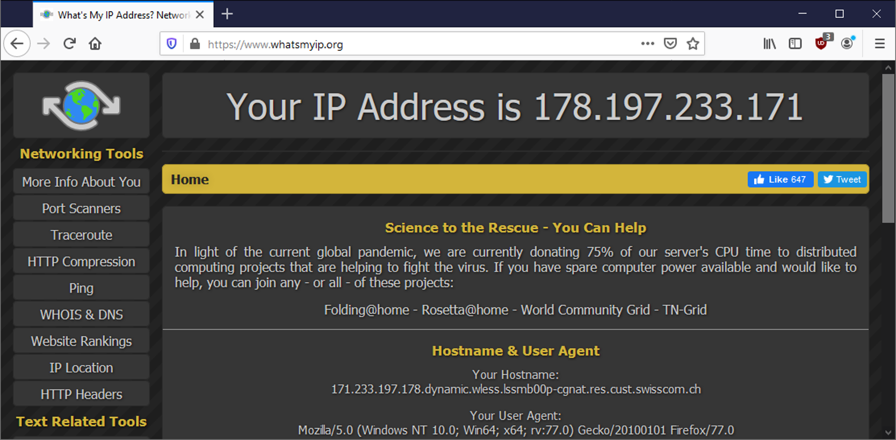

---
sidebar_custom_props:
  id: 48c3edd8-d17a-4215-96a3-2f4a0e350d82
---

# IP-Adresse
---

## Aufbau

Eine IP-Adresse setzt sich aus 4 Zahlen zu je 8 Bit zusammen. Diese 4 Zahlen werden im Dezimalsystem notiert und mit Punkten verbunden.

Beispiel: `194.124.132.216`

Die grösste Zahl, die mit 8 Bits dargestellt werden kann ist 255:

$$11111111_{[2]} = 1 + 2 + 4 + 8 + 16 + 32 + 64 + 128 = 255_{[10]}$$

Die Kleinste natürlich 0.

## meine IP

Jedes Gerät das mit dem Internet (oder einem lokalen Rechnernetz) verbunden ist, braucht eine IP-Adresse.

::: exercise

### :exercise: IP-Adresse finden (am Gymer)

Finde und notiere die IP-Adresse

- deines Computers
- deines Smartphones

Vergleiche die beiden IP-Adressen.

:::

::: details Tipp «IP-Adresse finden»
Du weisst nicht, wie man die IP-Adresse des eigenen Geräts findet?

Es gibt zahlreiche Anleitungen: Google z.B.

> _IP-Adresse finden Android_

oder

> _IP-Adresse finden Windows 10_

oder etwas Ähnliches, einfach angepasst auf dein Gerät resp. dein Betriebssystem.
:::

::: exercise

### :exercise: IP-Adresse finden (zuhause)

Finde und notiere die IP-Adresse

- deines Computers
- deines Smartphones

**Bei dir zu Hause!**

:::

## IP-Adresse

Normalerweise erhält jedes Gerät beim Beitritt zu einem Rechnernetz eine IP-Adresse zugewiesen. Die Adresse gehört zum
entsprechenden Netz und erlaubt die Kommunikation mit allen Geräten die sich ebenfalls im selben Netz befinden. Deshalb
erhält dein Gerät hier am Gymer eine andere Adresse als bei dir zu Hause.

Wenn du umziehst, bist du ja immer noch dieselbe Person. Allerdings ändert sich deine Wohnadresse – sie hängt davon ab,
wo sich dein zu Hause momentan befindet.

## Standardgateway

Für die Kommunikation nach Aussen, muss das Gerät sozusagen das nächste Verteilzentrum kennen. Dabei handelt es sich um
den sogenannten **Standardgateway**. Dieser lässt sich wie folgt anzeigen:

::: info Hinweis
Zu Hause hast du als Standardgateway die IP-Adresse deines Routers/Modems eingetragen – also dem Gerät, dass du von
deinem Internet-Anbieter erhältst, um Zugang zum Internet zu erhalten.
:::

::: exercise

### :exercise: Aufgabe

Gehe auf die Webseite [https://whatsmyip.org/](https://whatsmyip.org/). Was wird angezeigt?

Wieso unterscheidet sich diese IP-Adresse von der deines Gerätes?
:::

::: details Lösung
Bei der angezeigten Adresse handelt es sich um die IP-Adresse, welche im Internet sichtbar ist. Dein Gerät befindet sich
meist nicht direkt im Internet, sondern ist über den Router damit verbunden. Du siehst hier also die externe IP-Adresse
deines Routers/Modems.

(Router haben immer mindestens zwei IP-Adressen, weil sie zwei Netze miteinander verbinden und deshalb in beiden Netzen
eine IP-Adresse brauchen.)
:::

## Ping

Beim Ping-Befehl handelt es sich um ein Netzwerkdiagnose-Tool, womit man die Datenübertragung zu einem anderen Gerät
überprüfen kann. Dabei sendet man ein Signal an ein entferntes Gerät. Dieses Gerät sollte dann ein Signal zurücksenden.

    ping 185.167.79.61

::: exercise

### :exercise: Ping ausführen

Starte eine Eingabeaufforderung und führe Ping mit folgenden IP-Adressen aus:

    185.167.79.61
    8.8.8.8
    194.150.245.142
    <IP-Adresse des Pultnachbarn>

- Was bedeutet die Ausgabe?
- Wieso gibt es Unterschiede

:::

## :extra: IPv6-Adressen

Es gibt 2^32 = 4'294'967'296 verschiedene IPv4-Adressen. Auf den ersten Blick scheint die Anzahl sehr gross zu sein. Durch die Vielzahl an internetfähigen Geräten weltweit sind fast alle dieser Adressen inzwischen vergeben. Daher ist dringend eine neue Lösung nötig. Als Nachfolge für das IPv4-Protokoll steht seit Jahren IPv6 in den Startlöchern, es hat sich allerdings bisher noch nicht durchgesetzt.

Eine IPv6-Adresse besteht aus 16 Bytes, also aus 128 Bit. Damit gibt es 2^128 &#8776; 10^38 verschiedene Adressen. Somit stünden jedem Menschen ca. 10^28 IPv6-Adresse zur Verfügung (das sind etwa so viele, wie es Wassermoleküle in einem Eimer voll Wasser hat).

IPv6-Adressen werden als Hexadezimalzahl dargestellt. Dabei werden immer vier hexadezimale Ziffern (zwei Byte) zusammengefasst. Als Trennzeichen wird das Doppelpunkt `:` verwendet:

`2001:0db8:85a3:08d3:0000:0370:7344`

Da so unglaublich viele IPv6-Adressen zur Verfügung stehen, sind meist ganz viele Stellen im Innern der Adresse `0`. Diese braucht man nicht zu schreiben, da Viererblöcke, die komplett aus Nullen bestehen (`0000`), weggelassen werden dürfen. Eine solche **Auslassung** wird gekennzeichnet durch **zwei hintereinander stehende Doppelpunkte**. Die oben genannte Adresse kann also auch wie folgt geschrieben werden:

`2001:0db8:85a3:08d3::0370:7344`

Auch die führenden Nullen pro Viererblock dürfen weggelassen werden. IPv6-Adressen sind also nicht zwingend sehr lang, sie können durchaus kurz sein:

`2a13:182:81::65`