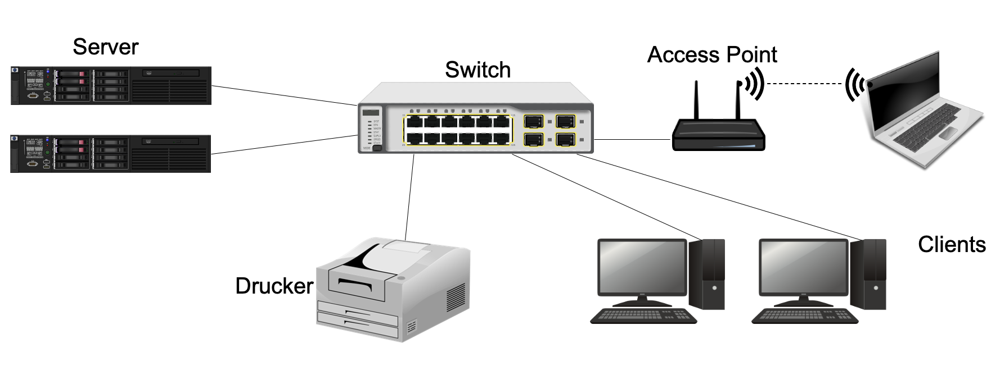
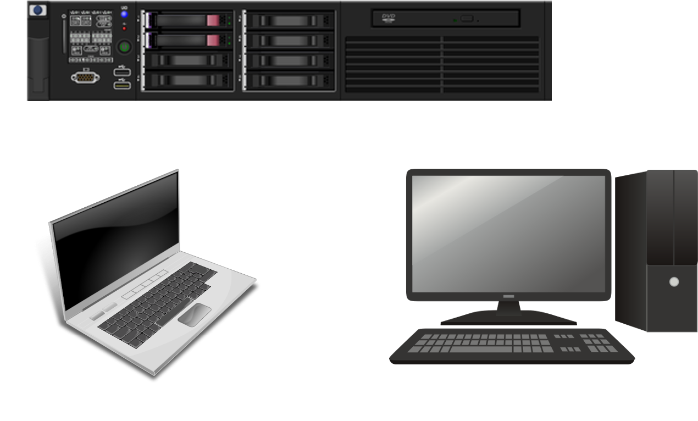

---
sidebar_custom_props:
  id: 6d38e98c-4375-4f30-875a-73ef78eaca28
---
# Rechnernetze
---

Werden zwei oder mehr Computer und andere Geräte wie Drucker durch Kabel oder Funkverbindungen (z.B. WLAN) 
zusammengeschlossen um Daten auszutauschen, spricht man von einem Rechnernetz.

## Host und Hostnamen
Geräte in einem Rechnernetz werden als `host` (engl. "Gastgeber") bezeichnet. Jeder `host` besitzt einen `Hostnamen` bzw. `hostname`.

::: exercise
### :exercise: Hostname
Finde den Hostnamen deines Computers heraus und notiere diesen.

***

  * Windows: Öffne das Programm "Eingabeaufforderung" und gib den Befehl `hostname` ein.
  * Mac: Öffne das Programm "Terminal" und gib den Befehl `hostname` ein.

:::

## Server und Client
Geräte werden je nach **Rolle** im Rechnernetz unterschiedlich benannt bzw. kategorisiert, entweder als `Server` oder als `Client`.
   * **Client**  = der Kunde/die Kundin; Computer, der etwas will
   * **Server**  = der Diener/die Dienerin; akzeptiert Verbindungen von Clients; Computer, der etwas hat, was andere brauchen

::: exercise
### :exercise: Server oder Client?

***

Normalerweise ist das 1. Bild der Server. Bei diesem Gerät ist die Hardware spezifisch für seine Rolle ausgelegt 
(konstanter Betrieb, grosse Leistung, gute Kühlung, ...). Allerdings ist auch ein Server zeitweise «Client», da er 
ebenfalls Dinge aus dem Netzwerk braucht (Updates, aktuelle Zeit, er schickt E-Mails, …).
Ein PC oder ein Notebook kann aber auch ein Server sein, wenn die entsprechende Software installiert ist!

:::
