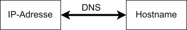
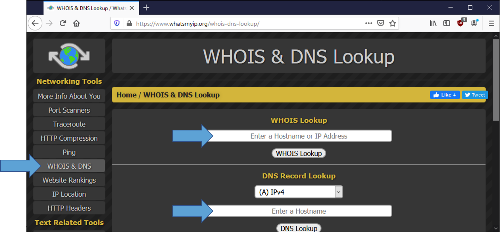

---
sidebar_custom_props:
  id: dc13c648-0f49-4709-a64c-609d278058e9
---
# Domain Name System (DNS)
---

Da wir Menschen uns nur sehr schlecht Zahlen merken können, wurden sogenannte Hostnames eingeführt. Diese Namen können
wir mehr oder weniger frei wählen. Da die Computer – wie wir gesehen haben – über IP-Adressen kommunizieren, braucht es
einen Übersetzungs-Dienst. Hier kommt das sogenannte **Domain Name System (DNS)** zum Zug. DNS ist ein Dienst, welcher
Hostnamen zu IP-Adressen auflöst und umgekehrt. Dies ist vergleichbar mit der Funktionsweise eines Telefonbuchs, das
Namen zu Telefonnummern auflöst und umgekehrt. 

Um den Dienst verwenden zu können, muss sich unser Gerät an einen
sogenannten DNS-Server wenden. Dessen IP-Adresse erhält das Gerät normalerweise beim Beitritt zu
einem lokalen Rechnernetz.

## Analogie DNS / Telefonbuch

### Forward Lookup (Vorwärtslookup): Name → Nummer

Beim Forward Lookup wird ein Hostname in eine IP-Adresse umgewandelt.

| Telefonbuch                                                          | Domain Name System (DNS)                                                                                                                                                                      |
|----------------------------------------------------------------------|-----------------------------------------------------------------------------------------------------------------------------------------------------------------------------------------------|
| Ich möchte die Person X anrufen, kenne die Telefonnummer aber nicht: | Ich gebe im Browser den Namen einer Webseite ein, z.B. `www.gymkirchenfeld.ch`. Der Computer versucht die Webseite darzustellen, braucht dazu aber die IP-Adresse des zugehörigen Webservers: |
| Wie lautet die Telefonnummer der Person X?                           | Welche IP-Adresse hat der Host `www.gymkirchenfeld.ch`?                                                                                                                                       |
| Ich erhalte die Nummer (sofern der Eintrag existiert).               | Mein Computer erhält eine IP-Adresse im gewohnten Format.                                                                                                                                     |

### Reverse Lookup (Rückwärtslookup): Nummer → Name

Beim Reverse Lookup wird eine IP-Adresse in einen Hostnamen umgewandelt.

| Telefonbuch                                                                                | DNS                                                                       |
|--------------------------------------------------------------------------------------------|---------------------------------------------------------------------------|
| Eine unbekannte Nummer Y hat versucht mich zu erreichen und ich möchte wissen, wer es ist. | Mein Server hat verdächtige Aktivität der IP-Adresse `185.167.79.61` festgestellt: |
| Wie lautet der Name des Eintrages mit der Telefonnummer Y?                                 | Welcher Hostname gehört zur IP-Adresse `185.167.79.61`?                  |
| Ich erhalte einen oder ev. auch mehrere Einträge aus dem Telefonbuch.                      | Evtl. gibt es einen Hostnamen zurück, evtl. mehrere, evtl. auch keinen.         |

## Hostnamen und IP-Adressen auflösen

### Über eine Webseite

Es gibt Webseiten, welche solche Dienste anbieten. Eine davon
ist [whatsmyip.org](https://www.whatsmyip.org/whois-dns-lookup/):

Alternativen:

- [https://constellix.com/dns-tools/dns-lookup](https://constellix.com/dns-tools/dns-lookup)
- [https://dnschecker.org/all-dns-records-of-domain.php](https://dnschecker.org/all-dns-records-of-domain.php)
- [https://mxtoolbox.com/DNSLookup.aspx](https://mxtoolbox.com/DNSLookup.aspx)

### Über die Eingabeaufforderung resp. den Terminal

In der Eingabeaufforderung resp. dem Terminal mit dem Befehl `nslookup`

#### Beispiel Vorwärtslookup:

    nslookup www.gymkirchenfeld.ch

#### Beispiel Rückwärtslookup:

    nslookup 185.167.79.61

::: exercise

### :exercise: IP-Adresse

Wie lautet die IP-Adresse von

    intern.gymkirchenfeld.ch
    sbb.ch
    www.unibe.ch

***

    185.167.79.61
    194.150.245.142
    130.92.232.93

:::

::: exercise

### :exercise: Hostname

Wie lautet der Hostname zu folgenden IP-Adressen

    8.8.8.8
    130.92.64.4
    192.168.1.54
    deine IP-Adresse

***

    dns.google
    asterix.inf.unibe.ch
    lokale Adresse,	nicht im Internet erreichbar!
    wie oben oder, wenn die externe eingegeben wird, 

:::
