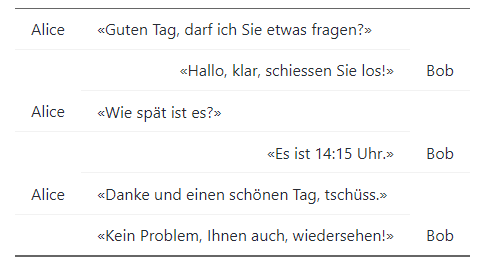
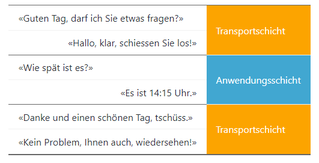
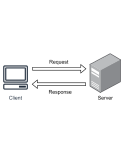
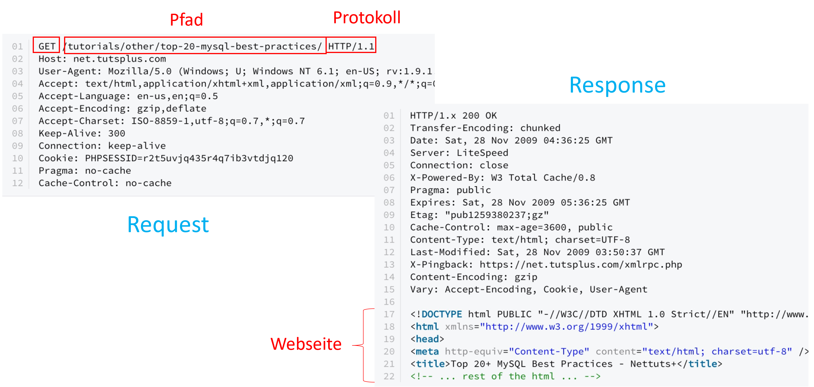

---
sidebar_custom_props:
  id: 142c2d27-2370-4ebd-9d79-73c01da8c347
---
# Protokolle

---

Ein Netzwerkprotokoll ist eine festgelegte Regel, die bestimmt, wie Daten zwischen Computern ausgetauscht werden. Es...

- ...definiert den Ablauf einer Kommunikation.
- ...definiert den Aufbau der Datenpakete.
- ...existiert auf unterschiedlichen Ebenen.

## Protokolle bei uns Menschen

Nehmen wir als Beispiel eine Diskussion zwischen zwei Fremden: Die eine Person (Alice) fragt jemand anderes (Bob) nach
der Uhrzeit:

Dabei fragen wir nicht direkt, wir begrüssen uns zuerst und stellen klar, dass wir etwas fragen möchten. Wenn wir also
die obenstehende Diskussion in drei Teile zerlegen, dann können wir die drei Anfragen von Alice je einer Schicht
zuteilen:

Auf der *Transportschicht* wird eine **Verbindung** hergestellt und diese am Schluss auch wieder getrennt. Dies ist für
alle
Anfragen gleich. Die **eigentlichen Daten** werden dann in der *Anwendungsschicht* übermittelt, also dort, wo die Frage
gestellt und eine Antwort darauf gegeben wird. Dies funktioniert beim Computer auf gleiche Weise. Gewisse Protokolle
regeln die
Verbindung zwischen zwei Geräten, andere definieren den **Aufbau der Datenpakete** für die **Anwendungen**.

## Kommunikation zwischen Computern

Die Kommunikation zwischen zwei Computern, also zwischen Client und Server, läuft oft nach dem Frage/Antwort- bzw.
`Request/Response`-Muster ab:

## Einfache Protokolle

Die gewünschte Anwendung und somit auch das Protokoll wird mit einer sogenannten **Portnummer** angegeben. Man kann sich
das
sozusagen als Türnummer merken: Die IP-Adresse liefert das richtige Gebäude, die Portnummner das zuständige Büro. Die
Portnummer (z.B. 8000) wird mit Doppelpunkt hinter die IP-Adresse gehängt.

    192.168.42.167:8000

Die folgenden drei Protokolle kann man mit einem sogenannten Telnet-Client einfach selbst ausprobieren. Dazu verbindet
man sich mit einem Server auf dem gewünschten Port. Läuft der Dienst und befolgt man die Regeln des Protokolls, so
sollte man auch eine Antwort erhalten:

| Dienst           | Server            | Port |
|:-----------------|:------------------|:-----|
| Daytime          | time-a.nist.gov   | 13   |
| Quote-of-the-Day | djxmmx.net        | 17   |
| Echo             | admin.ad.kinet.ch | 7    |

::: details Zusatzaufgabe Protokolle
::: exercise

### :exercise: Zusatzaufgabe Einfache Protokolle

- Teste die obenstehenden Protokolle aus, indem du mit Telnet eine Verbindung zum entsprechenden Port auf dem Server
  herstellst.
- Inwiefern unterscheidet sich das Echo-Protokoll von den anderen beiden?

Ev. hast du Telnet auf deinem Computer installiert, dann kannst du in einer Eingabeaufforderung die Verbindung starten
mit `telnet <server> <port>` (wobei `<server>` und `<port>` entsprechend ersetzt werden müssen).

Falls Telnet nicht verfügbar ist, kannst du es vielleicht aktivieren:
[https://social.technet.microsoft.com/wiki/contents/articles/38433.windows-10-enabling-telnet-client.aspx](https://social.technet.microsoft.com/wiki/contents/articles/38433.windows-10-enabling-telnet-client.aspx)

Letze Möglichkeit wäre ein Online-Telnet zu verwenden – also eine Webseite die den Telnet-Dienst zur Verfügung stellt.
Dies funktioniert aber nur eingeschränkt:

- [https://adminkit.net/telnet.aspx](https://adminkit.net/telnet.aspx)

***

Unterschied Echo-Protokoll zu Daytime- und Quote-of-the-Day-Protokoll:

- Art der Anfrage: Der Client sendet eine Nachricht (Nutzdaten) an den Server. Bei den beiden anderen Protokollen wird
  ein leeres
  Datenpaket gesendet (die Anfrage ist implizit durch die Verbindung).
- Art der Antwort: Beim Echo-Protokoll sendet der Server die empfangenen Daten unverändert zurück. Beim
  Daytime-Protokoll sendet Server die aktuelle Uhrzeit und das Datum zurück.
  Beim QOTD-Protokoll sendet der Server ein Zitat zurück.
  
 **Hinweis:** Das Echo Protokoll (Port 7) ist heute bei fast allen öffentlichen Domains deaktiviert, um die Gefahr von DDoS-Angriffen zu vermeiden. Da der Server die (beliebigen) Daten des Clients zurück sendet, kann das Protokoll genutzt werden, um Server absichtlich zu überlasten. 

:::

## HTTP und HTTPS

Die **Hypertext-Transfer-Protokolle** sind etwas komplizierter als die drei einfachen Protokolle die wir soeben
kennengelernt haben. Bei HTTP(S) gibt es unterschiedliche Arten von **Requests**(Anfragen):

### GET-Request

Mit einem GET-Request verlangt der Client (z.B. der Webbrowser auf deinem Laptop) vom Server ein bestimmtes Dokument.
Dies kann eine HTML-Datei, aber auch ein Bild oder sonst eine Datei sein.

- Der Server schickt nun den Status-Code `200 OK` und die gewünschte Datei.
- Oder aber er schickt einen anderen Status-Code, z.B. `404 Not Found` für «nicht gefunden» oder `403 Forbidden` für
  «keine Berechtigung».

So kann der Browser entsprechend reagieren.

### POST-Request

Mit einem POST-Request kann der Client ein im Browser ausgefülltes Formular (z.B. Login-Daten oder Angaben um Account zu
erstellen) an den Server schicken, damit der Server die entsprechenden Schritte unternehmen kann.

### weitere Requests

Daneben gibt es PUT-, DELETE- und weitere Requests.

### Beispiel Request und Response

Das folgende Bild zeigt je ein Beispiel des Aufbaus eines Get-Requests und der Response des Webservers.

::: details Zusatz: Entwicklungstools

Die Entwicklungstools des Browsers zeigen dir im Tab «Network» alle Requests an, die bei einem Seitenaufruf gemacht
werden.

::: exercise

### :exercise: Gymer-Logo

Auf unserer [Gymer-Seite](https://www.gymkirchenfeld.ch/) findest du links oben den «gym|kirchenfeld»-Schriftzug.
Kannst du diese Bild-Datei abspeichern?

Versuch es mit den Entwicklungstools deines Browsers.

::: exercise

### :exercise: Radio-Stream

Auf [https://energy.ch](https://energy.ch) findest du diverse Internet-Radio-Streams. Damit du die Streams auch mit
einem Medien-Player (z.B. VLC) abspielen kannst, musst du diese abspeichern können.

Wähle ein Radio und versuch den Stream mit den Entwicklungstools deines Browsers abzuspeichern.
:::

