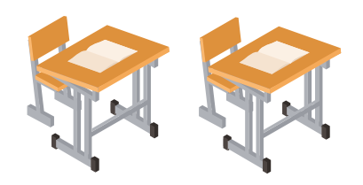
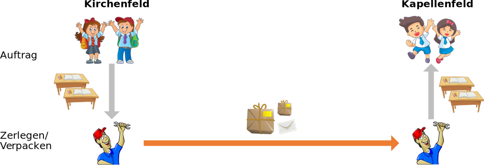
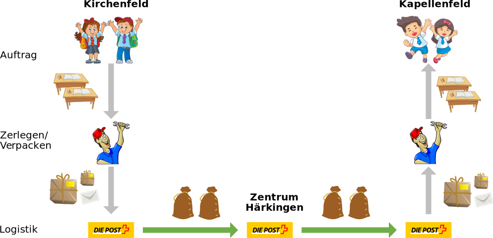
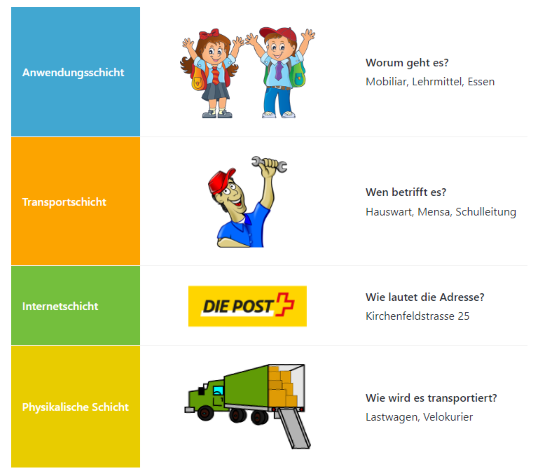
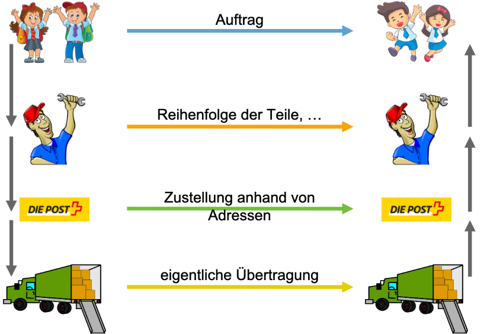

---
sidebar_custom_props:
  id: e6bcaf18-103c-41df-bed2-4634e0a3c7b9
---
# Schichtenmodell
---

Viele komplexe Vorgänge und Konstruktionen können mithilfe eines sogenannten *Schichtenmodells* in einfachere
Einzelteile
aufgespalten werden.

Wir wollen die Vorteile des Schichtenmodells anhand eines Beispiels versuchen zu verstehen:

## Beispiel «Paketversand»

Die Schule Kapellenfeld feiert 100-jähriges Jubiläum und braucht für ihr Fest zusätzliche Schulpulte. Wir möchten helfen
und einige Pulte schicken.

- Wie funktioniert dies genau?
- Wer ist alles involviert?

### Ablauf des Versandes

 

 

 

 

### Die Schichten

Wenn wir im obigen Beispiel die Schichten ansehen, dann ist jede Schicht für einen bestimmten Schritt zuständig.

### Protokolle

Wir können auch sagen: Jede Schicht hat ein Protokoll. Dieses beschreibt wie die Daten weitergegeben und auch wieder
entpackt werden:

## Vorteile des Schichtenmodells

### Aufbau auf bestehendem

Ohne Probleme liesse sich das obenstehende Beispiel verwenden, um andere Inhalte zu transportieren. So könnten statt Pulten
auch Stühle – oder z.B. auch Esswaren transportiert werden. So funktioniert auch unser Postsystem: Bis auf wenige Ausnahmen transportiert die Post alles.

::: exercise

### :exercise: Aufbau auf bestehendem

Was könnte noch Übertragen werden, wobei die unteren Schichten verwendet werden?
:::

### Austauschbare Schichten

Die Schichten können ausgetauscht werden, solange sie ihre Aufgabe erfüllen und die Schnittstelle zwischen der darüber- und der darunterliegenden Schicht erfüllt wird.

- Die Post kann auch mit dem Flugzeug oder dem Zug transportiert werden. 
- Statt der Post kann man einen privaten Transportservice engagieren. 
- Statt des Hauswartes können Schüler*innen die Pulte auseinanderschrauben und wieder zusammensetzen.

::: exercise

### :exercise: Schichten austauschen

Siehst du andere Möglichkeiten wo eine Schicht ausgetauscht werden könnte?
:::

