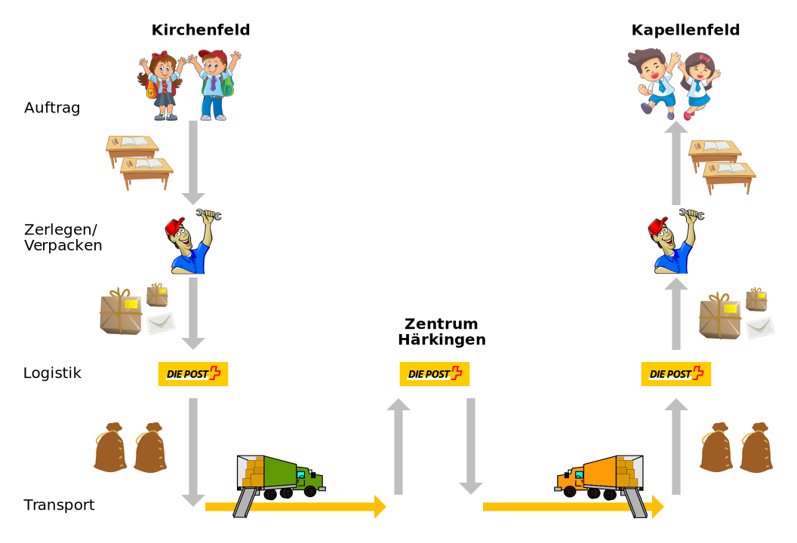

---
sidebar_custom_props:
  id: 8a081e7e-dc9b-4ba3-b84d-34becccc3c3b
---
# Schicht 1: Physikalische Schicht

Auf der physikalischen Schicht geht es um das konkrete Transportmittel (Velokurier, Lastwagen, ... resp. WLAN, LAN,
Mobilfunk, ...). Auch hier werden Adressen benötigt, es sind weltweit eindeutige Adressen, die fix an das Gerät geknüpft
sind.

## Beispiel Schule

Im Beispiel Schule werden die Pakete irgendwie zum Paketzentrum gebracht, dort umsortiert und weiter an ihr Ziel
verfrachtet.

## Internet

Die physikalische Schicht besteht aus der Hardware, also den Kabeln und Geräten und den physikalischen Signalen.
Hier werden schlussendlich wirklich Nullen und Einsen von Gerät zu Gerät übermittelt. Dies geschieht mit sogenannten
*Ethernet-Frames* und den physikalischen Adressen der Geräte.
Die physikalische Adresse wird *MAC-Adresse* genannt.

<v-video id="ZhEf7e4kopM" source="youtube"></v-video>

## Protokolle

**ARP**

**MAC**
