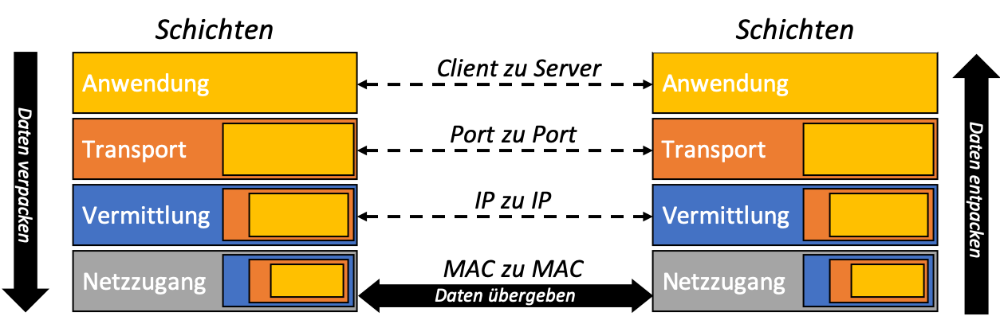
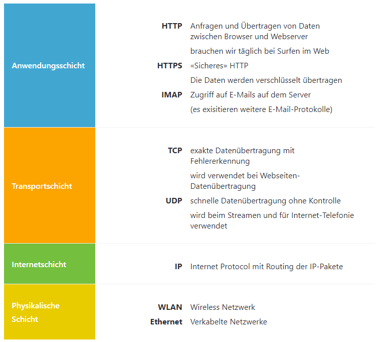

---
sidebar_custom_props:
  id: db68f34f-c81d-4d71-97f3-643a66f4d36b
---
# TCP/IP-Schichtenmodell

---

Genauso wie die Pakete im Beispiel übermittelt werden, geschieht dies auch in Computer-Netzwerken mit den 
**Datenpaketen**.

- Die oberen Schichten verwenden Dienste der unteren Schichten.
- Jede Schicht verpackt die Daten neu, wenn sie von der darüberliegenden Schicht übergeben werden und entpackt sie
  wieder beim Empfangen bevor sie wieder an die darüberliegende Schicht übergeben werden
- Jede Schicht hat einen bestimmten Auftrag.

Die **Vorteile des Schichtenmodells** gelten auch bei Computer-Netzwerken:

- **Aufbau auf Bestehendem**: Die Übertragung von E-Mails und die einer Webseite unterscheidet sich nur in der obersten
  Schicht. Beide bauen auf den 3 identischen unteren Schichten auf.
- **Austauschbare Schichten**: Daten können Kabelgebunden oder per Funk übertragen werden. Swisscom- oder UPC-Anschluss
  fürs Internet zu
  Hause.

## Protokolle im TCP/IP-Modell

Die von unseren Computern und Smartphones verwendeten Protokolle werden im sogenannten TCP/IP-Modell zusammengefasst.
Dieses unterteilt die Protokolle in **4 Schichten**, wobei die beiden mittleren, namensgebenden Schichten sozusagen das
Fundament bilden. Für die Anwendungsschicht existieren zahlreiche weitere Protokolle, die hier nicht genauer erläutert
werden.

Wenn wir die Analogie mit dem Gespräch und der Frage nach der Uhrzeit (Kapitel [Protokolle](?page=7-protocols/) auf die
weiteren Ebenen/Schichten adaptieren
möchten, so könnte man sagen:

* **Anwendung**: ist der Dienst, also was gefragt werden soll (Uhrzeit, Weg zum Bahnhof)

* **Transport**: Verbindung herstellen: Hallo, darf ich? Merci und Tschüss

* **Internet**: Sprache, z.B. Deutsch – wird für Verbindungsaufbau und Frage/Antwort verwendet

* **Physikalisch**: Schallwellen in der Luft welche die Wörter übertragen

